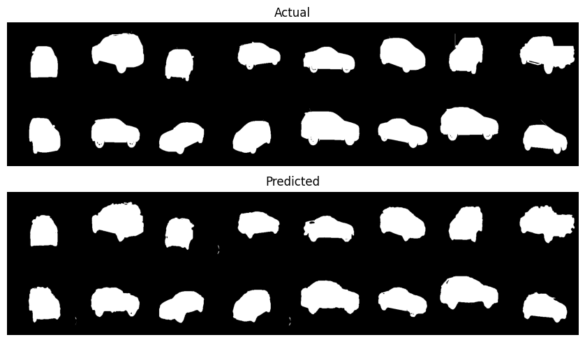

### Overview

An image segmentation model is created to predict the masks for images of cars from the [Carvana Image Masking challenge](https://www.kaggle.com/competitions/carvana-image-masking-challenge/overview). The data directory contains 5088 zipped train files and train masks files and the zipped test files.

#### Model
Image preprocessing via flipping, rescaling, normalising and rotation  is applied to the train set only. A custom dataloader is used to load the data with 30% of the data used for validation. The U-net model and a custom Conv model is defined used to generate the masks after training for 10 epochs twice.

#### Results after training;
<picture>
 <source media="(prefers-color-scheme: dark)" srcset="output.png">
 <source media="(prefers-color-scheme: light)" srcset="output.png">
 
</picture>

<picture>
 <source media="(prefers-color-scheme: dark)" srcset="output_2.png">
 <source media="(prefers-color-scheme: light)" srcset="output_2.png">
 
</picture>
